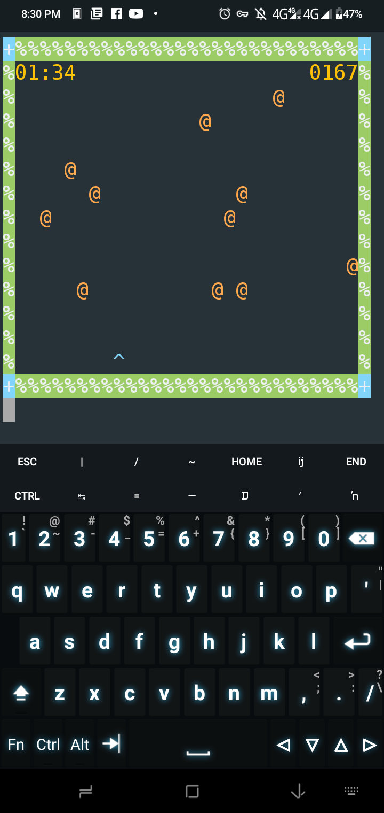

# REQUIREMENTS
```
> pip install colorama
```
# RUN A FILE
```
> python main.py
```

# Controller
|Key|Name| 
----|----
|A|Left|
|W|Up|
|D|Right|
|S|Down|
|C|Cheat|
|G|auto|
|F|Show/Hide Fps
|X|asteroid
|Ctrl+c|Exit Game

# PREVIEW

